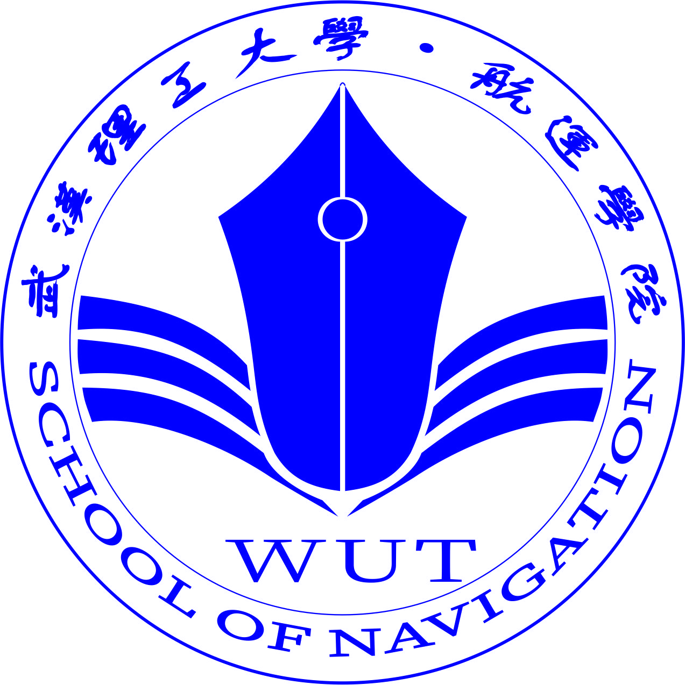
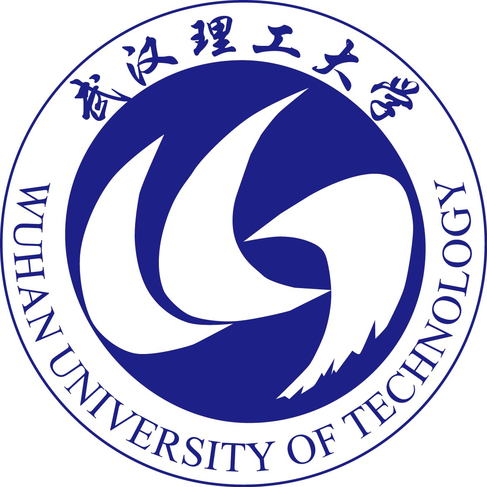
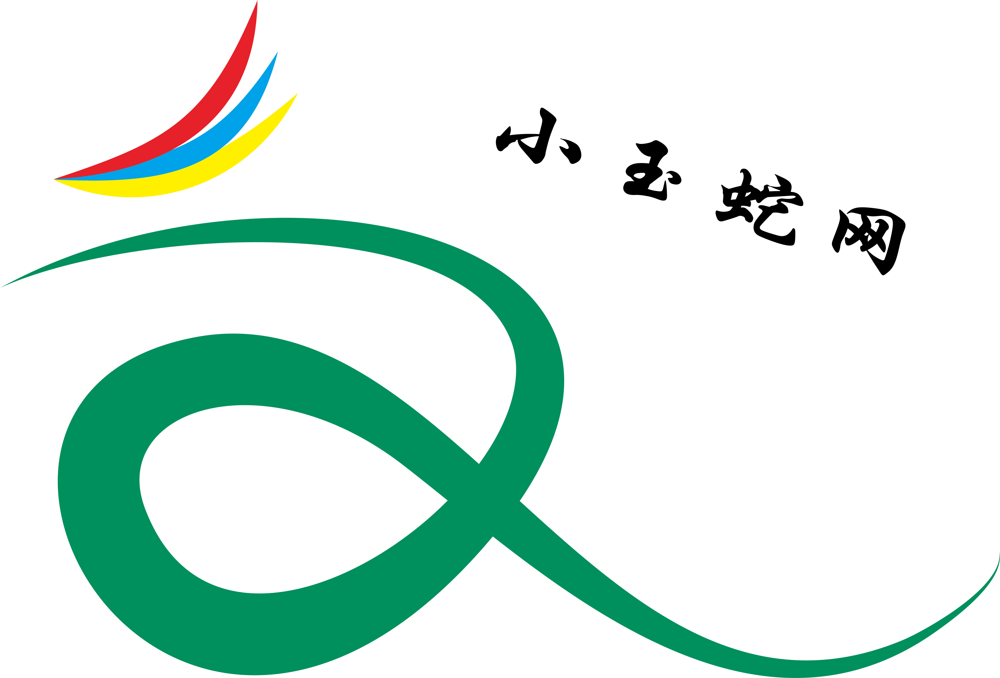
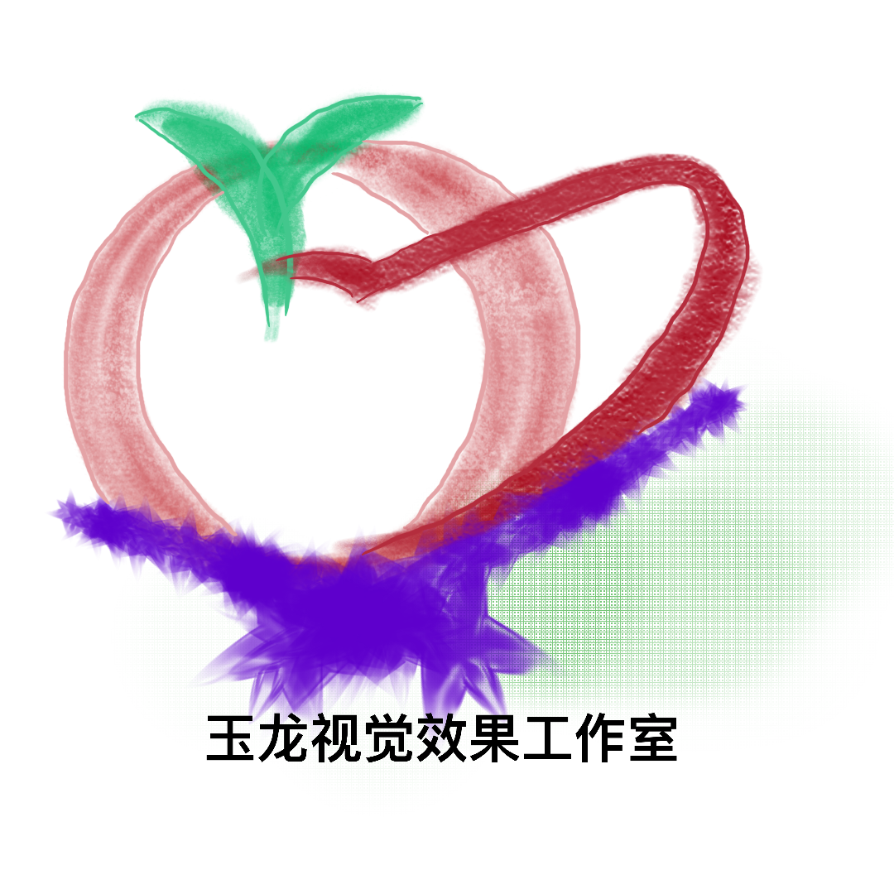

# 我的设计之旅  

可能从一开始, 我就对这个世界充满了好奇, 不断探索, 不断发掘和感受  
喜欢设计, 大一的时候梦想有自己的设计工作室, 喜欢看一些奇思妙想的设计图像, 后来喜欢上了程序设计, 更高的定制性和更好的展示效果  

### 之前模仿了华为的设计风格, 点~线~面和邀请函的学习 :  
  

### 学习PS, CorelDraw 等绘图软件, 复刻学校校徽, 学院院徽, 校研会会徽等, 得到了高精度高还原的Logo, 制作校园活动海报等用得上  

  
  
  

### 自己的一些设计  

自己的感觉随心所欲, 随便画的一些Logo, 最近重新手绘之前的Logo作为头像使用, 今后继续更新Logo设计  

  
  
  

