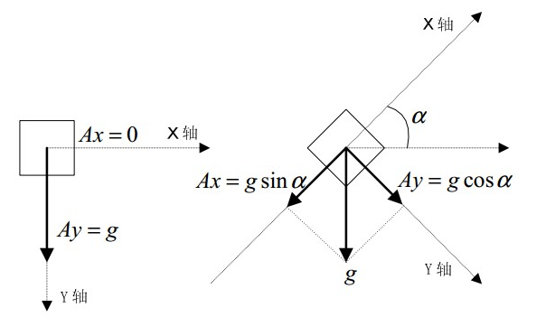
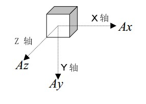

# 传感器详细说明

[TOC]

---

## ADXL335三轴加速计的使用案例

[**根据加速度求取倾角的原理(官方)**](./resrc/ADXL335倾角计算原理.pdf)  
官方网站针对加速计的使用进行了详细说明

[**参考地址CSDN**](http://blog.csdn.net/ling3ye/article/details/51469152)  
使用加速计进行读取数据的案例

[**官方网址**](http://www.analog.com/cn/products/mems/accelerometers/adxl335.html#product-overview)  
对ADXL335型号加速计详细的介绍，包括硬件部分

## 根据加速度求取倾角的具体计算过程：

[百度上的参考](https://wenku.baidu.com/view/c63b187c5acfa1c7aa00cc7c.html)  

  

如图所示，有$Ax = g \sin \alpha, Ay = g \cos \alpha, then \frac{Ax}{Ay} = \tan \alpha$，即$\alpha = \arctan(\frac{Ax}{Ay})$  
这样，就可以根据在x、y轴上的加速度求取倾斜角度（注意：这是静止状态，运动过程需要提高采样频率）

**二维平面具有局限性，所以使用3维的加速度计算**  

与上面类似的计算过程，可以得出倾斜角度公式$\alpha = \arctan( \frac{\sqrt{{Ax}^2 + {Az}^2}}{Ay} )$  

  

x需要说明的是，这里利用的是物体静止时受到重力的性质，如果物体同时也有加速度的话，这个公式不再准确
需要增加一个限制条件

$$
\begin {cases}
\alpha = \arctan(\frac{\sqrt{{Ax}^2 + {Ay}^2}}{Ay})  \\
\sqrt{{Ax}^2 + {Az}^2 + {Ay}^2} = 1g
\end{cases}
$$

### 软件算法

如上公式所示的计算方法  
**反三角函数算法**  
1. 测量xyz三轴的加速度，Ax、Ay、Az
2. 计算$Ax^2 + Az^2 + Ay^2$，如果这个平方接近1g的平方，那么说明这组采样值是有效的，可以用来计算，否则丢弃，重复第一步
3. 利用有效的采样值，通过开平方和反正切函数的科学计算，计算出倾斜角度$\alpha = \arctan(\frac{\sqrt{Ax^2+Az^2}}{Ay})$
4. 重复第一步

**查表算法**  
第一种算法的计算两庞大，需要高性能硬件的配合。如果避开这些计算，则可以大幅度降低算法复杂度  
分两步降低算法复杂度：  
1. 利用整数开方代替C函数开方  
2. 利用查表代替正切计算，即提前计算每个角度$\alpha$的正切值$\tan$，并保存在EEPROM中，那么在计算过程中，只需要计算$\frac{\sqrt{Ax^2 + Az^2}}{Ay}$，并在表中查找接近的正切值，那么相应的角度就是所求角度  

### 倾斜角度的精度与角速度的分辨率之间的额关系  

根据前面的计算公式，又有$\sqrt{Ax^2+Ay^2+Az^2} = 1g$可以简化公式为$\alpha = \arctan(\frac{\sqrt{(1g)^2 - Ay^2}}{Ay})$，公式中只有一个变量Ay  

倾斜角度越大，精度越低，具体参考前面的百度网址

