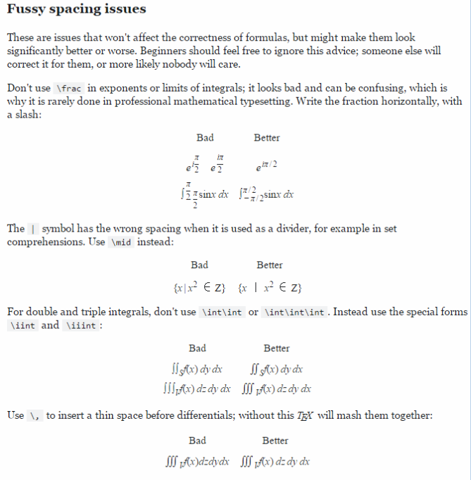

# MathJax basic tutorial and quick reference

## Latex Fomular
[Latex公式编辑](https://en.wikipedia.org/wiki/Help:Displaying_a_formula)  


[TOC]

# 公式基础

## 行内公式和行间公式

对行内公式，把公式放在`$...$`之内，对于展示公式，使用`$$...$$`
行内公式测试 $\sum_{i=0}^n i^2 = \frac { (n^2+n)(2n+1) }{6}$ 显示在行内
显示行间公式

```MathJax
$$ \sum_{ i = 0}^n i^2 = \frac{ (n^2+n)(2n+1)} {6} $$
```

$$ \sum_{ i = 0}^n i^2 = \frac{ (n^2+n)(2n+1)} {6} $$

## 希腊字符是表示

对于Greek希腊字符，使用 `\alpha`, `\beta `, ..., ` \omega `:  $\alpha, \beta, ..., \omega$
对于大写字符, `Delta`, `Omega`, `\Gamma`, $\Delta, \Omega, \Gamma$

## 上标和下标

对于上标和下表使用`^`, `_`, 例如，`x_i^2` : $x_i^2$, `\log_2 x` : $\log_2 x$

## 编组Groups，使用{}

一些例子，`10^10`: $10^10$，显示不正确，应当--> `10^{10}`: $10^{10}$
`{x^y}^z`: ${x^y}^z$

## 圆括号 () []

需要输入括号时，使用斜杠前置，如`\(`, `\{`, `\[ `
如果不使用前面的反斜杠，则不能同公式一同缩放，如果你写`(\frac{\sqrt x}{y^3})`,小括号将会显示的很小，将会显示成$ (\frac{\sqrt x}{y^3}) $
如果使用`\left(` ... `\right )`，将会使括号的尺寸自动适应公式的大小
`\left ( \frac {\sqrt x}{y^3}\right) `, 显示成$\left( \frac {\sqrt x}{y^3} \right)$
其他的括号：
`\vert ` : $\vert$
`\angle ` : $\angle$
`\langle `:$\langle$ and `rangle` : $\rangle$
`\lceil ` and `rceil` : $\lceil$ and  $\rceil$
and also `\lfloor ` and `rfloor` ; $\lfloor$ and $\rfloor$
也有一些不可见的括号，用`.`表示
`\left.\frac 1 2 \right \rbrace ` is $\left.\frac 1 2 \right \rbrace$

## 积分和微分

`\sum ` and `\int`===
例子
`\sum_1^{n^2}` : $\sum_i^{n^2}$
`\sum_{i=0}^\infty i^2` is $\sum_{i=0}^\infty i^2$
similarly, `\prod ` : $\prod$, and `\int ` : $\int$,and bigcup -->  $\bigcup$
also `\iint ` : $\iint$

## 分数

`\frac ab` : displayed as $\frac a b$, and `\frac {a+1}{b+1}` : $\frac {a+1} {b+1}$
numerator分子   denominator 分母
如果分子和分母结构是复杂的，可以使用`\over `，可以把分子分母分开来写，${a+1} \over {b+1}$

## 字体

不常用，只列出一些命令
\mathbb    or     \Bbb
\mathbf
\mathtt
\mathrm
\mathsf
\mathcal
\mathscr
\mathfrac

## 根号Radical signs

使用`sqrt`，如`\sqrt ` ：$\sqrt{x^3}$
`\sqrt[3]{\frac x y}` : $\sqrt[3]{\frac x y}$

## 其它功能

`\lim `, `\sin ` : $\lim and \sin x$
例如`\lim_{x \to 0}` : $\lim_{x \to 0}$

## 很多的其他符号

## 空格

要加空格，需要使用`\ `, 例如对于小空格ab ：$a\ b$
大空格使用`quad` and `qquad` : $a \quad b \ and \ a \qquad b$
如果在公式中插入普通文本，使用`\text ` \text{...}

## 强调和区别标记

\hat and \widehat
\bar and \overline
\vec and \overrightarrow and \overleftrightarrow
don't use in this format `\\`, should use as `\backslash`

# 矩阵

## 基本的矩阵写法

`$$\begin{matrix}...\end{matrix}$$`将矩阵放在\begin{matrix}与\end{matrix}之间，每行矩阵以`\\`结尾，换行
使用`&`来分割矩阵元素(直接看源码，不写标注了)

```MathJax
\begin{matrix}
1 & x & x^2 \\
1 & y & y^2 \\
1 & z & z^2 \\
\end{matrix}
```

$$
\begin{matrix}
1 & x & x^2 \\
1 & y & y^2 \\
1 & z & z^2 \\
\end{matrix}
$$

为矩阵添加框架，不是使用`\left \right `，使用矩阵特有的
`pmatrix` `bmatrix` `Bmatrix` `vmatrix` `Vmatrix`
使用`\cdots `...`ddots`, `vdots`，在矩阵中表示省略的点
注：array后边的`cc|c`表示显示的格式

$$
\left[
\begin{array}{cc|c}
1 & 2 & 3 \\
4 & 5 & 6 \\
\end{array}
\right]
$$

对于行内的矩阵，使用小的矩阵形式矩阵$ \bigl( \begin {smallmatrix}...\end{smallmatrix} \bigr) $在行内中显示
显示一个觉得例子，在矩阵$\bigl( \begin{smallmatrix} a & b \\ c & d \\ \end{smallmatrix} \bigr)$中显示abcd

# 公式对齐

有人想让一系列公式对齐，使用`\begi{align}...\end{align}`，每行必须使用`\\`来换行，并且在对齐的地方使用`&`(ampersand)
```MathJax
\begin{align}
\sqrt{37} & = \sqrt { \frac {73^2-1} {12^2} } \\
& = \sqrt { \frac{73^2}{12^2} \cdot \frac{73^2-1}{73^2} } \\
& = \sqrt {\frac{73^2}{12^2} } \cdot \sqrt{ \frac{73^2-1}{73^2} } \\
& = \frac{73}{12} \cdot \sqrt {1 - \frac{1}{73^2} } \\
& \approx \frac{73}{12} \left( 1-\frac{1}{2 \cdot 73^2} \right)  \\
\end{align}
```

$$
\begin{align}
\sqrt{37} & = \sqrt { \frac {73^2-1} {12^2} } \\
& = \sqrt { \frac{73^2}{12^2} \cdot \frac{73^2-1}{73^2} } \\
& = \sqrt {\frac{73^2}{12^2} } \cdot \sqrt{ \frac{73^2-1}{73^2} } \\
& = \frac{73}{12} \cdot \sqrt {1 - \frac{1}{73^2} } \\
& \approx \frac{73}{12} \left( 1-\frac{1}{2 \cdot 73^2} \right)  \\
\end{align}
$$

# 符号

有一个识别手写符号的网站
[Anyone who works with LaTeX knows how time-consuming it can be to find a symbol in [symbols-a4.pdf][1] that you just can't memorize, Detexify is an attempt to simplify this search](http://detexify.kirelabs.org/classify.html)  

[1] : http://www.ctan.org/tex-archive/info/symbols/comprehensive/  

# 分段函数

使用格式`\begin{cases}...\end{cases}`，每个cases以`\\`结束，并且使用`&`来对齐(\text 可以在公示中插入普通文本plain text)

```MathJax
f(n) = 
\begin{cases}
n/2, & \text{if $n$ is even} \\
3n+1, & \text{if $n$ is odd} \\
\end{cases}
```

$$
f(n) = 
\begin{cases}
n/2, & \text{if $n$ is even} \\
3n+1, & \text{if $n$ is odd} \\
\end{cases}
$$

```MathJax
\left .
\begin{array}{l}
\text {if $n$ is even:} &n/2 \\
\text {if $n$ is odd:} &3n+1 \\
\end{array}
\right \}
= f(n)
```

$$
\left .
\begin{array}{l}
\text {if $n$ is even:} &n/2 \\
\text {if $n$ is odd:} &3n+1 \\
\end{array}
\right \}
= f(n)
$$

两个公式之间有大的空间，我们可以使用`\\[2ex]` 代替`\\`
```MathJax
$$
f(n) = 
\begin{cases}
\frac{n}{2}, & \text {if $n$ is even} \\[2ex]
3n+1, & \text {if $n$ is odd} \\[2ex]
\end{cases}
$$
```
$$
f(n) = 
\begin{cases}
\frac{n}{2}, & \text {if $n$ is even} \\[2ex]
3n+1, & \text {if $n$ is odd} \\[2ex]
\end{cases}
$$

# 阵列，数组

在MathJax中使用表格或数组更易读，Arrays和Tables可以使用`array`来创建，在`\begin{array} `之后列出每列，使用`c`可以居中排列，`l`是左对齐而`r`是右对齐，`|`表示竖直线，像矩阵类似的格式，使用`&`来划分单元，每行最后使用`\\`，添加水平线使用`\hline`
```MathJax
\begin{array}{l|lcr}
n & \text{left} & \text{center} & \text{right} \\
1 & 0.24 & 1 & 125 \\
2 & -1 & 189 & -8 \\
3 & -20 & 2000 & 1 + 10i \\
\end{array}
```

$$
\begin{array}{l|lcr}
n & \text{left} & \text{center} & \text{right} \\
1 & 0.24 & 1 & 125 \\
2 & -1 & 189 & -8 \\
3 & -20 & 2000 & 1 + 10i \\
\end{array}
$$

# 间距问题

  

图片中显示了一些由于间距造成的美观问题
在使用`|`时应当替换成`\mid`，可以使得间距变大
不要使用`\int \int ` or `\int \int \int `, 应当替换成`\iint ` or `\iiint`  

# 颜色

# 取消划线

使用`\cancle`

# 系统等式

使用`\begin{array}.\end{array}` and `\left\{...\right.`

```MathJax
\left \{
\begin{array}{c}
a_1 x + b_1 y + c_1 z = d_1 \\
a_2 x + b_2 y + c_2 z = d_2 \\
a_3 x + b_3 y + c_3 z = d_3 \\
\end{array}
\right .
```

$$
\left \{
\begin{array}{c}
a_1 x + b_1 y + c_1 z = d_1 \\
a_2 x + b_2 y + c_2 z = d_2 \\
a_3 x + b_3 y + c_3 z = d_3 \\
\end{array}
\right .
$$

我们可以使用`\begin{cases}...\end{cases}`

```MathJax
\begin{cases}
a_1 x + b_1 y + c_1 z &= d_1 + e_1 \\
a_2 x + b_2 y &= d_2 \\
a_3 x + b_3 y + c_3 z &= d_3 \\
\end{cases}
```

$$
\begin{cases}
a_1 x + b_1 y + c_1 z &= d_1 + e_1 \\
a_2 x + b_2 y &= d_2 \\
a_3 x + b_3 y + c_3 z &= d_3 \\
\end{cases}
$$

使用`\begin{aligned}...\end{aigned}`和`\left \{...\right .`来对齐公式

```MathJax
\left \{
\begin{aligned}
a_1 x + b_1 y + c_1 z &= d_1 + e_1 \\
a_2 x + b_2 y &= d_2 \\
a_3 x + b_3 y + c_3 z &= d_3 \\
\end{aligned}
\right .
```

$$
\left \{
\begin{aligned}
a_1 x + b_1 y + c_1 z &= d_1 + e_1 \\
a_2 x + b_2 y &= d_2 \\
a_3 x + b_3 y + c_3 z &= d_3 \\
\end{aligned}
\right .
$$

```MathJax
\begin{cases}
a_1 x + b_1 y + c_1 z = \frac{p_1}{q_1} \\
a_2 x + b_2 y + c_2 z = \frac{p_2}{q_2} \\
a_3 x + b_3 y + c_3 z = \frac{p_3}{q_3} \\
\end{cases}
```

$$
\begin{cases}
a_1 x + b_1 y + c_1 z = \frac{p_1}{q_1} \\
a_2 x + b_2 y + c_2 z = \frac{p_2}{q_2} \\
a_3 x + b_3 y + c_3 z = \frac{p_3}{q_3} \\
\end{cases}
$$

# 连分数

使用`\cfrac `而不能使用`\frac ` or `\over` 

# 其它装饰

\overline
\underline
\widetilde
\widehat
\fbox
\underleftarrow
\underrightarrow
...

# tags（标签）和参考

对于一些长的计算公式，使用等式标签`\tag{yourtag} `，如果你想参考哪个标签，添加`\label{somelabel} ` 在`tag`标签的正后方，没必要你的标签和label一样

```MathJax
a := x^2 - y^3 \tag{*} \label{*}

a+y^3 \stackrel{\eqref{*}} = x^2
```

$$
a := x^2 - y^3 \tag{*} \label{*}
$$

为了能够参考一个公式，使用`\eqref{somelabel}`

$$
a+y^3 \stackrel{\eqref{*}} = x^2
$$

# 大括号

使用`\left `和`\right `后面跟括号，可以缩放括号, curly braces大括号

```MathJax
f\left(
\left [
\frac{
  1+\left\{ x,y \right\}
}{
  \left(
  \frac{x}{y}+\frac{y}{x}
  \right)
  \left( u+1 \right)
}+a
\right ]^{3/2}
\right)
```

$$
f\left(
\left [
\frac{
  1+\left\{ x,y \right\}
}{
  \left(
  \frac{x}{y}+\frac{y}{x}
  \right)
  \left( u+1 \right)
}+a
\right ]^{3/2}
\right)
$$

注意：大括号需要使用`\{ \ \}`
如果你使用一个大括号`\left `并且匹配右括号`\right `在不同的行，使用`\right. ` and `\left. `来隐藏括号，因此

```
\left\langle
q
\middle\|
\frac{\frac{x}{y}}{\frac{u}{v}}
\middle\|
\right\rangle
```

$$
\left\langle
q
\middle\|
\frac{\frac{x}{y}}{\frac{u}{v}}
\middle\|
\right\rangle
$$

# 自定义操作符

# 无限

limits and lim

```
$ \lim \limits_{x \to 1} \frac{x^2 - 1}{x-1} $
```

$ \lim \limits_{x \to 1} \frac{x^2 - 1}{x-1} $

# 绝对值与泛数

一些值得绝对值可以表示(denoted)为`\lvert x \rvert `，更通常的，
`\left \lvert ... \right\rvert`

```
|x|, ||v||
\quad \longrightarrow \quad \lvert x \rvert, \lVert v \rVert
```

$$
|x|, ||v||
\quad \longrightarrow \quad \lvert x \rvert, \lVert v \rVert
$$

# 左右箭头

```
$\Rightarrow$, $\Leftarrow$ and $\Leftrightarrow$
```

$\Rightarrow$, $\Leftarrow$ and $\Leftrightarrow$

# 对于每行的等式给出原因

```
\begin{align}
v + w &= 0 && \text{Given} \tag 1 \\
-w &= -w + 0 && \text{additive identity} \tag 2 \\
-w + 0 &= -w + (v + w) && \text{equation $(1)$ and $(2)$ } \\
\end{align}
```

$$
\begin{align}
v + w &= 0 && \text{Given} \tag 1 \\
-w &= -w + 0 && \text{additive identity} \tag 2 \\
-w + 0 &= -w + (v + w) && \text{equation $(1)$ and $(2)$ } \\
\end{align}
$$

# 高亮等式

```
\bbox[yellow]
{
e^x = \lim_{n \to \infty} \left( 1+\frac{x}{n} \right)^n \qquad(1)
}
```

$$
\bbox[yellow]
{
e^x = \lim_{n \to \infty} \left( 1+\frac{x}{n} \right)^n \qquad(1)
}
$$

add border, use `\bbox[Spx, border:2px solid red]`

# long division

```
\require{enclose}
\begin{array}{r}
13 \\[-3pt]
4 \enclose{longdiv}{52} \\[-3pt]
\underline{4}\phantom{2} \\[-3pt]
12 \\[-3pt]
\underline{12}
\end{array}
```

$$
\require{enclose}
\begin{array}{r}
13 \\[-3pt]
4 \enclose{longdiv}{52} \\[-3pt]
\underline{4}\phantom{2} \\[-3pt]
12 \\[-3pt]
\underline{12}
\end{array}
$$

# 角度符号

角度符号不是`^\circ `，尽管许多人这么用，但是实际效果并不是按照规则的
例如错误的显示$ 90^\circ$

# 垂直空间

```
$ \sqrt{\mathstrut a} - \sqrt{\mathstrut b} $
$ \sqrt{\vphantom{b} a} - \sqrt{b} $
```

$ \sqrt{\mathstrut a} - \sqrt{\mathstrut b} $
$ \sqrt{\vphantom{b} a} - \sqrt{b} $

# 显示样式和文本样式

许多像分数fraction，和sums，极限limits和积分显示在行内公式时，你可以转换样式使用`\displaystyle ` and `\textstyle ` 以便能够实现理想的显示
display显示为立体形式，textstyle显示为平面形式

```
\sum_{n=1}^\infty \frac{1}{n^2} \to
\textstyle \sum_{n=1}^\infty \frac{1}{n^2} \to
\displaystyle \sum_{n=1}^\infty \frac{1}{n^2}
```

$$
\sum_{n=1}^\infty \frac{1}{n^2} \to
\textstyle \sum_{n=1}^\infty \frac{1}{n^2} \to
\displaystyle \sum_{n=1}^\infty \frac{1}{n^2}
$$

```
compare $\displaystyle \lim_{t \to 0} \int_t^1 f(t) \, dt $
versus $ \textstyle  \lim_{t \to 0} \int_t^1 f(t) \, dt $
```

compare $\displaystyle \lim_{t \to 0} \int_t^1 f(t) \, dt $
versus $ \textstyle  \lim_{t \to 0} \int_t^1 f(t) \, dt $


