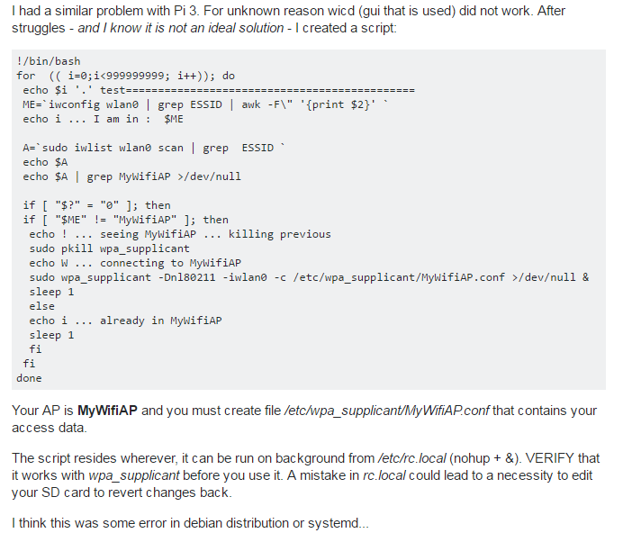

# RespberryPi **config summary**

[TOC]

## 树莓派开机启动程序

### [参考地址：树莓派官方网站](https://www.raspberrypi.org/documentation/linux/usage/rc-local.md)  

当树莓派启动时，能够运行一个命令或者程序，你可以添加命令到`rc.local`文件中
编辑rc.local必须使用管理员权限
`sudo nano /etc/rc.local`
在注释下面添加命令，在最后一行必须写上`exit 0`，保存并退出  

**警告**：如果你的程序或命令会一直运行，必须在命令后添加ampersand`&`
`python /home/pi/myscript.py &`  
否则，这个程序将会永无终止，并且Pi无法启动，`&`使得命令运行在一个独立的进程中  
确保文件路径是使用绝对路径，而不是相对路径，例如`/home/pi/myscript.py` not as `myscript.py`  

### 或者使用一个工具，调度任务工具：[CRON](https://www.raspberrypi.org/documentation/linux/usage/cron.md)  

安装带有图形界面的CRON`sudo apt-get install gnome-schedule`
具体参见官方网址...

## 树莓派自动连接Wifi

### [参考1](http://weworkweplay.com/play/automatically-connect-a-raspberry-pi-to-a-wifi-network/)  

编辑网络连接接口文件：
`sudo nano /etc/network/interfaces`
这个文件中包含所有已知的网络接口，在最后添加文件路径，这个文件路径是你的网络配置路径`/etc/wpa_supplicant/wpa_supplicant.conf`

```
allow-hotplug wlan0
iface wlan0 inet dhcp
wpa-conf /etc/wpa_supplicant/wpa_supplicant.conf
iface default inet dhcp
```

在配置文件中写出

```
network={
ssid="YOUR_NETWORK_NAME"
psk="YOUR_NETWORK_PASSWORD"
proto=RSN
key_mgmt=WPA-PSK
pairwise=CCMP
auth_alg=OPEN
}
```

#### 设置静态IP

打开`/etc/network/interfaces`添加下面的代码  
将`iface wlan0 inet dhcp`改成`iface wlan0 inet static`  
这个操作将DHCP改成静态的  
在wpa-conf前添加下面的代码  

```
address 192.168.1.155 # Static IP you want  
netmask 255.255.255.0  
gateway 192.168.1.1   # IP of your router  
```

下面是整个的配置文件内容：

```
# /etc/network/interfaces

auto wlan0

iface lo inet loopback
iface eth0 inet dhcp

allow-hotplug wlan0
iface wlan0 inet static
address 192.168.1.155
netmask 255.255.255.0
gateway 192.168.1.1
wpa-conf /etc/wpa_supplicant/wpa_supplicant.conf
iface default inet dhcp
```

```
# /etc/wpa_supplicant/wpa_supplicant.conf

ctrl_interface=DIR=/var/run/wpa_supplicant GROUP=netdev
update_config=1

network={
ssid="NYO_WWWP"
psk="topsecret"
proto=RSN
key_mgmt=WPA-PSK
pairwise=CCMP
auth_alg=OPEN
}
```

### [参考2](https://raspberrypi.stackexchange.com/questions/51771/connecting-the-pi3-automatically-to-wifi)  

同样是修改接口文件`interface`
下面是其中的一个回答，编写了一个脚本来处理



## 树莓派的使用

### 树莓派安装系统教程

[蓝宇论坛树莓派资料](http://www.landzo.cn/thread-13327-1-1.html)  

[**树莓派无线网络和自动运行设置**](./RespberryPi.md)  


